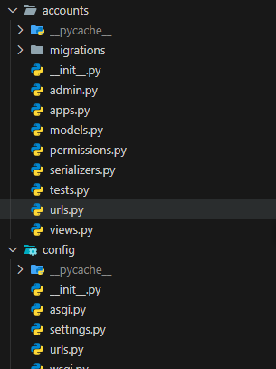
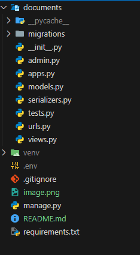

# Role-Based File Sharing System - Backend

This is the backend API for the **Role-Based File Sharing System**, built with **Django**, **Django REST Framework (DRF)**, and **JWT Authentication**. It manages users, departments, file uploads, and role-based access control.

## 🔗 Features

- 👤 Custom `User` model with roles: `ADMIN`, `HR`, `EMPLOYEE`
- 🏢 Departments
- 📁 File uploads  to Cloudinary
- 🔐 JWT-based authentication
- 🔎 Flexible search, filter, and download endpoints
- 👨‍💼 Admin can create users and assign departments
- 🔄 Employees can upload/view only department-specific files
- 📂 Admin can view all uploaded files

## 🔧 Technologies Used

- Django
- Django REST Framework
- djangorestframework-simplejwt
- Cloudinary 
- CORS headers
- PostgreSQL 

## 📁 Project Structure

├── accounts/ # Custom user model, departments

├── documents/ # File upload model and views

├── config/ # project configuration

   ├── settings.py # App settings and installed apps

    ├── urls.py # API routing

## ⚙️ Setup Instructions

### Prerequisites

- Python >= 3.9
- pip
- virtualenv

### Installation

git clone https://github.com/jenberu/rrbfs-backend.git

cd role-based-file-sharing-backend

python -m venv env

source env/bin/activate   # On Windows: env\Scripts\activate

pip install -r requirements.txt

Run Development Server

python manage.py runserver

The API will run at http://localhost:8000

Environment Variables

CLOUDINARY_URL=cloudinary://<api_key>

SECRET_KEY=your-secret-key

DEBUG=True

Migrations & Superuser

python manage.py makemigrations

python manage.py migrate

python manage.py createsuperuser

